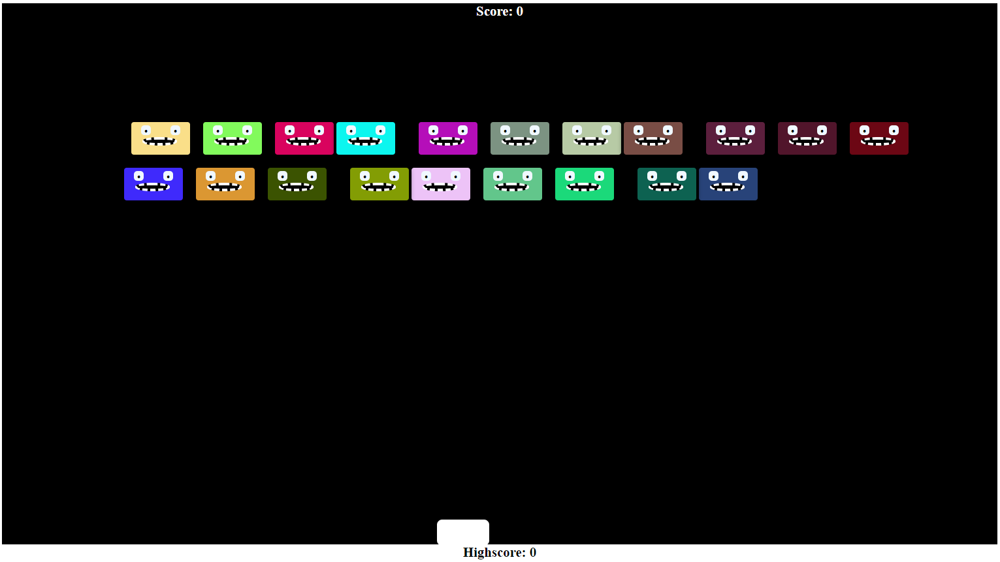

# Alien-Invaders

## About

Alien Invaders is a game made in Javascript. The player controls the white block at the bottom of the screen using the arrow keys. The goal of the game is to destroy all the aliens at the top before they reach the bottom.

 

  

## Features

The game has:
- 3 power-ups
- 3 levels
- highscore tracking

## How to play

### `Left arrow key - move left`
### `Right arrow key - move right`
### `Up arrow key - shoot`

## Usage

Open the index.html file